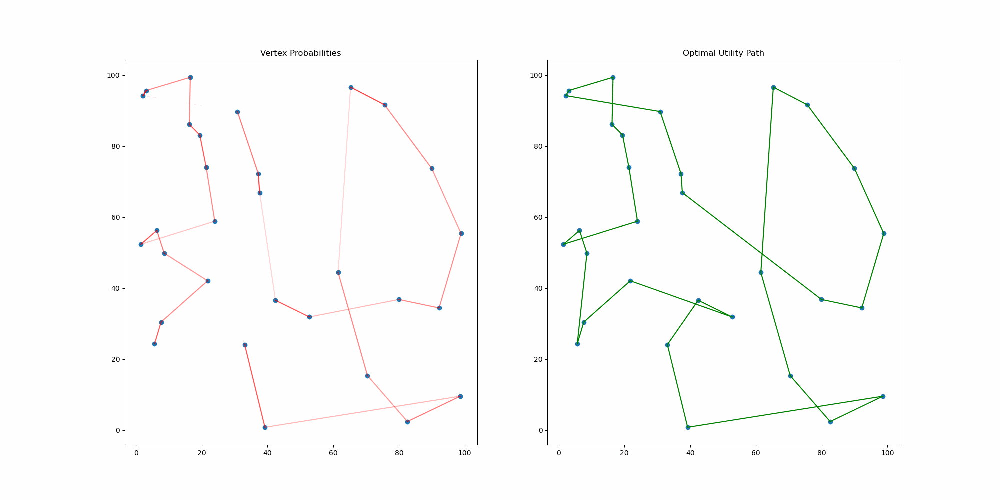

# Ant Colony System for TSP
A quick implementation of the ACS solution to the travelling salesman problem with animation.  
Agents will pick the path with the best utility depending on a combination of distance and amount of pheromones.
In a RL fashion, the colony will converge to the optimal solution.
Stability is however a bit difficult to reach and is highly depend on the parameters of the simulation, future work could try to improve this.

## Example 
In this particular example, the ACS algorithm struck a 20% improvement over the standard greedy algorithm. 

## References
<a href="https://www.sciencedirect.com/science/article/pii/S0303264797017085">[1]</a> Ant colonies for the travelling salesman problem, Marco Dorigo, Luca Maria Gambardella  
<a href="https://www.youtube.com/watch?v=81GQNPJip2Y&t=0s">[2]</a> C++ Ants Simulation 1, First approach 
